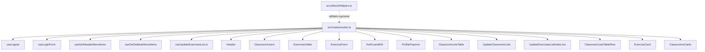

# Plano: Substituir strings hardcoded por constantes ROUTES

## Visão Geral

Substituir todas as strings de navegação hardcoded no projeto pelas constantes definidas em `src/routes/routes.ts`, corrigir os bugs existentes no arquivo de rotas e criar o utilitário `src/utils/urlHelpers.ts`.

---

## Arquivos a modificar (ordem de execução)

### 1. `src/routes/routes.ts` — Corrigir bugs + adicionar PROFILE

**Problema:** As funções `CLASSROOM_LISTS`, `CLASSROOM_USERS`, `CLASSROOM_LIST_EXERCISE` e `CLASSROOM_LIST_UPDATE` em `ROUTES` tentam chamar `.replace(":classroomId", ...)` em strings relativas (`"lists"`, `"users"`, `"lists/:listId/..."`) que **não contêm** `:classroomId`. O resultado é uma URL incorreta (ex: `"lists"` em vez de `"/classroom/abc/lists"`).

**Solução:** Usar template literals diretamente nas funções de `ROUTES`. Também adicionar `PROFILE: "/profile"`.

**Conteúdo final do arquivo:**

```ts
export const ROUTE_PATTERNS = {
  // Auth
  LOGIN: "/login",

  // Geral
  TESTE: "/teste",
  HOME: "/home",
  PLAYGROUND: "/playground",

  // Exercises
  EXERCISES: "/exercises",
  EXERCISES_CREATE: "/exercises/create",
  EXERCISE_DETAIL: "/exercises/:exerciseId/info",

  // Profile
  PROFILE: "/profile",

  // Admin
  USERS: "/users",
  CLASSROOMS: "/classrooms",
  LISTS: "/lists",

  // Classroom (path relativo — usado como filho de CLASSROOM)
  CLASSROOM: "/classroom/:classroomId",
  CLASSROOM_LISTS: "lists",
  CLASSROOM_USERS: "users",
  CLASSROOM_LIST_EXERCISE: "lists/:listId/exercise/:exerciseId",
  CLASSROOM_LIST_UPDATE: "lists/:listId/update-exercises",
} as const;

export const ROUTES = {
  // Auth
  LOGIN: ROUTE_PATTERNS.LOGIN,

  // Geral
  TESTE: ROUTE_PATTERNS.TESTE,
  HOME: ROUTE_PATTERNS.HOME,
  PLAYGROUND: ROUTE_PATTERNS.PLAYGROUND,

  // Profile
  PROFILE: ROUTE_PATTERNS.PROFILE,

  // Exercises
  EXERCISES: ROUTE_PATTERNS.EXERCISES,
  EXERCISES_CREATE: ROUTE_PATTERNS.EXERCISES_CREATE,
  EXERCISE_DETAIL: (exerciseId: string | number) =>
    `/exercises/${exerciseId}/info`,

  // Admin
  USERS: ROUTE_PATTERNS.USERS,
  CLASSROOMS: ROUTE_PATTERNS.CLASSROOMS,
  LISTS: ROUTE_PATTERNS.LISTS,

  // Classroom — funções geram URLs absolutas para navegação
  CLASSROOM: (classroomId: string | number) => `/classroom/${classroomId}`,
  CLASSROOM_LISTS: (classroomId: string | number) =>
    `/classroom/${classroomId}/lists`,
  CLASSROOM_USERS: (classroomId: string | number) =>
    `/classroom/${classroomId}/users`,
  CLASSROOM_LIST_EXERCISE: (
    classroomId: string | number,
    listId: string | number,
    exerciseId: string | number,
  ) => `/classroom/${classroomId}/lists/${listId}/exercise/${exerciseId}`,
  CLASSROOM_LIST_UPDATE: (
    classroomId: string | number,
    listId: string | number,
  ) => `/classroom/${classroomId}/lists/${listId}/update-exercises`,
};
```

> **Nota:** Removida a anotação de tipo explícita `Record<string, string | ((...args: any[]) => string)>` para que TypeScript infira os tipos precisos de cada propriedade. Isso elimina a necessidade de `as string` nos call sites.

---

### 2. `src/utils/urlHelpers.ts` — Criar arquivo novo

Utilitário para construção segura de URLs, complementando `ROUTES`.

```ts
/**
 * Garante que um ID seja uma string não-vazia antes de usá-lo em uma URL.
 * Lança erro em desenvolvimento se o ID for inválido.
 */
export function assertRouteId(
  id: string | number | null | undefined,
  label = "id",
): string {
  if (!id && id !== 0) {
    if (import.meta.env.DEV) {
      console.warn(`[urlHelpers] assertRouteId: "${label}" is empty or null`);
    }
    return "";
  }
  return String(id);
}

/**
 * Retorna true se a string for um path absoluto válido (começa com "/").
 */
export function isAbsolutePath(path: string): boolean {
  return path.startsWith("/");
}
```

---

### 3. `src/modules/auth/hooks/useLogout.ts`

**Mudança:** Importar `ROUTES` e substituir `"/login"`.

```diff
+ import { ROUTES } from "@/routes/routes";

- navigate("/login", { replace: true });
+ navigate(ROUTES.LOGIN, { replace: true });
```

---

### 4. `src/modules/auth/components/LoginForm/useLoginForm.ts`

**Mudança:** Importar `ROUTES` e substituir `"/home"`.

```diff
+ import { ROUTES } from "@/routes/routes";

- navigate("/home", { replace: true });
+ navigate(ROUTES.HOME, { replace: true });
```

---

### 5. `src/modules/auth/hooks/useGetHeaderMenuItems.ts`

**Mudança:** Importar `ROUTES` e substituir `"/home"`, `"/playground"`, `"/exercises"`.

```diff
+ import { ROUTES } from "@/routes/routes";

- link: "/home",
+ link: ROUTES.HOME,

- link: "/playground",
+ link: ROUTES.PLAYGROUND,

- link: "/exercises",
+ link: ROUTES.EXERCISES,
```

---

### 6. `src/modules/auth/hooks/useGetSidebarMenuItems.ts`

**Mudança:** Importar `ROUTES` e substituir todas as strings hardcoded.

```diff
+ import { ROUTES } from "@/routes/routes";

- link: "/home",
+ link: ROUTES.HOME,

- link: "/users",
+ link: ROUTES.USERS,

- link: "/classrooms",
+ link: ROUTES.CLASSROOMS,

- link: "/exercises",
+ link: ROUTES.EXERCISES,

- link: "/lists",
+ link: ROUTES.LISTS,

- link: `/classroom/${params?.classroomId}/lists`,
+ link: ROUTES.CLASSROOM_LISTS(params?.classroomId!),

- link: `/classroom/${params?.classroomId}/users`,
+ link: ROUTES.CLASSROOM_USERS(params?.classroomId!),
```

---

### 7. `src/modules/classroom/components/UpdateExercisesList/useUpdateExercisesList.ts`

**Mudança:** Importar `ROUTES` e substituir a navegação após sucesso.

```diff
+ import { ROUTES } from "@/routes/routes";

- navigate(`/classroom/${classroom?.uuid}/lists`);
+ navigate(ROUTES.CLASSROOM_LISTS(classroom?.uuid!));
```

---

### 8. `src/components/common/Header/Header.tsx`

**Mudança:** Importar `ROUTES` e substituir `to="/home"`.

```diff
+ import { ROUTES } from "@/routes/routes";

- <Link className="flex items-center gap-2" to="/home">
+ <Link className="flex items-center gap-2" to={ROUTES.HOME}>
```

---

### 9. `src/modules/classroom/components/ClassroomUsers/index.tsx`

**Mudança:** Importar `ROUTES` e substituir `"/home"` (2 ocorrências).

```diff
+ import { ROUTES } from "@/routes/routes";

- { label: "🏠 Home", href: "/home" },
+ { label: "🏠 Home", href: ROUTES.HOME },

- <BackLink to="/home">Voltar para Home</BackLink>
+ <BackLink to={ROUTES.HOME}>Voltar para Home</BackLink>
```

---

### 10. `src/modules/exercise/components/ExercisesTable/index.tsx`

**Mudança:** Importar `ROUTES` e substituir 2 strings.

```diff
+ import { ROUTES } from "@/routes/routes";

- <Link to={`/exercises/${exercise?.uuid}/info`}>Ver</Link>
+ <Link to={ROUTES.EXERCISE_DETAIL(exercise?.uuid!)}>Ver</Link>

- <Link to="/exercises/create">Criar Exercício</Link>
+ <Link to={ROUTES.EXERCISES_CREATE}>Criar Exercício</Link>
```

---

### 11. `src/modules/exercise/components/ExerciseForm/index.tsx`

**Mudança:** Importar `ROUTES` e substituir `"/exercises"` (2 ocorrências).

```diff
+ import { ROUTES } from "@/routes/routes";

- { label: "🧩 Exercícios", href: "/exercises" },
+ { label: "🧩 Exercícios", href: ROUTES.EXERCISES },

- <BackLink to="/exercises">Voltar para lista de exercícios</BackLink>
+ <BackLink to={ROUTES.EXERCISES}>Voltar para lista de exercícios</BackLink>
```

---

### 12. `src/components/ui/feedback/NotFound404/NotFound404.tsx`

**Mudança:** Importar `ROUTES` e substituir `"/home"`.

```diff
+ import { ROUTES } from "@/routes/routes";

- <Link to="/home" replace>
+ <Link to={ROUTES.HOME} replace>
```

---

### 13. `src/components/ui/overlay/ProfilePopover/ProfilePopover.tsx`

**Mudança:** Importar `ROUTES` e substituir `"/profile"`.

```diff
+ import { ROUTES } from "@/routes/routes";

- <Link to="/profile">
+ <Link to={ROUTES.PROFILE}>
```

---

### 14. `src/modules/list/components/ClassroomListsTable/index.tsx`

**Mudança:** Importar `ROUTES` e substituir `"/home"`.

```diff
+ import { ROUTES } from "@/routes/routes";

- <BackLink to="/home">Voltar para Home</BackLink>
+ <BackLink to={ROUTES.HOME}>Voltar para Home</BackLink>
```

---

### 15. `src/modules/list/components/UpdateClassroomLists/index.tsx`

**Mudança:** Importar `ROUTES` e substituir 3 strings hardcoded.

```diff
+ import { ROUTES } from "@/routes/routes";

- { label: "🏠 Home", href: "/home" },
+ { label: "🏠 Home", href: ROUTES.HOME },

- { label: "📝 Listas", href: `/classroom/${classroom?.uuid}/lists` },
+ { label: "📝 Listas", href: ROUTES.CLASSROOM_LISTS(classroom?.uuid!) },

- <Link to={`/classroom/${classroom?.uuid}/lists`}>
+ <Link to={ROUTES.CLASSROOM_LISTS(classroom?.uuid!)}>
```

---

### 16. `src/modules/classroom/components/UpdateExercisesList/index.tsx`

**Mudança:** Importar `ROUTES` e substituir 3 strings hardcoded.

```diff
+ import { ROUTES } from "@/routes/routes";

- { label: "🏠 Home", href: "/home" },
+ { label: "🏠 Home", href: ROUTES.HOME },

- { label: "📝 Listas", href: `/classroom/${classroom?.uuid}/lists` },
+ { label: "📝 Listas", href: ROUTES.CLASSROOM_LISTS(classroom?.uuid!) },

- <BackLink to={`/classroom/${classroom?.uuid}/lists`}>
+ <BackLink to={ROUTES.CLASSROOM_LISTS(classroom?.uuid!)}>
```

---

### 17. `src/modules/list/components/ClassroomListsTable/ClassroomListsTableRow/index.tsx`

**Mudança:** Importar `ROUTES` e substituir o link dinâmico.

```diff
+ import { ROUTES } from "@/routes/routes";

- <Link to={`/classroom/${list?.classroom?.uuid}/lists/${list?.uuid}/update-exercises`}>
+ <Link to={ROUTES.CLASSROOM_LIST_UPDATE(list?.classroom?.uuid!, list?.uuid!)}>
```

---

### 18. `src/modules/exercise/components/ExerciseCard/index.tsx`

**Mudança:** Importar `ROUTES` e substituir o link dinâmico.

```diff
+ import { ROUTES } from "@/routes/routes";

- <Link to={`/classroom/${exercise?.classroom?.uuid}/lists/${exercise?.listExercise?.uuid}/exercise/${exercise?.uuid}`}>
+ <Link to={ROUTES.CLASSROOM_LIST_EXERCISE(exercise?.classroom?.uuid!, exercise?.listExercise?.uuid!, exercise?.uuid!)}>
```

---

### 19. `src/modules/classroom/components/ClassroomsCards/index.tsx`

**Mudança:** Importar `ROUTES` e substituir o link dinâmico.

```diff
+ import { ROUTES } from "@/routes/routes";

- <Link to={`/classroom/${classroom?.uuid}/lists`}>Acessar</Link>
+ <Link to={ROUTES.CLASSROOM_LISTS(classroom?.uuid!)}>Acessar</Link>
```

---

## Diagrama de dependências



---

## Checklist de execução

- [ ] Corrigir `src/routes/routes.ts` (bugs CLASSROOM_LISTS/USERS/LIST_EXERCISE/LIST_UPDATE + adicionar PROFILE + remover tipo explícito)
- [ ] Criar `src/utils/urlHelpers.ts`
- [ ] Atualizar `useLogout.ts`
- [ ] Atualizar `useLoginForm.ts`
- [ ] Atualizar `useGetHeaderMenuItems.ts`
- [ ] Atualizar `useGetSidebarMenuItems.ts`
- [ ] Atualizar `useUpdateExercisesList.ts` (hook)
- [ ] Atualizar `Header.tsx`
- [ ] Atualizar `ClassroomUsers/index.tsx`
- [ ] Atualizar `ExercisesTable/index.tsx`
- [ ] Atualizar `ExerciseForm/index.tsx`
- [ ] Atualizar `NotFound404.tsx`
- [ ] Atualizar `ProfilePopover.tsx`
- [ ] Atualizar `ClassroomListsTable/index.tsx`
- [ ] Atualizar `UpdateClassroomLists/index.tsx`
- [ ] Atualizar `UpdateExercisesList/index.tsx` (componente)
- [ ] Atualizar `ClassroomListsTableRow/index.tsx`
- [ ] Atualizar `ExerciseCard/index.tsx`
- [ ] Atualizar `ClassroomsCards/index.tsx`
